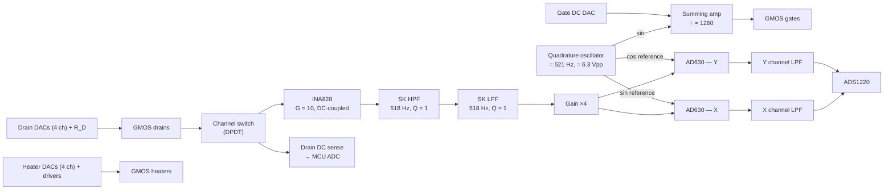
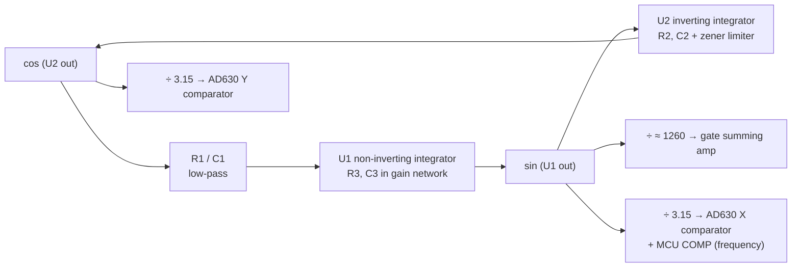
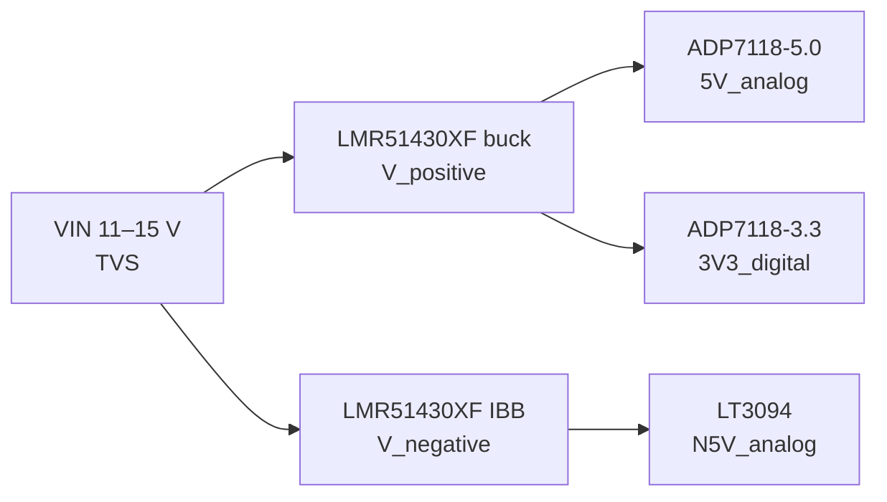

The schematic is split into the following sheets:
 
| Sheet | Content |
|-------|---------|
| 1 | Connectors, GMOS socket |
| 2 | Analog readout section |
| 3 | Digital readout section |
| 4 | DC (power) section |

## 4. Analog Section
 
### 4.1 Functions
 
The analog section is responsible for:
 
1. Gate bias: DC component (DAC) summed with the AC excitation sine.
2. Drain bias: DAC-controlled voltage applied through a series resistor, with drain-voltage (current) measurement.
3. Heater bias: DAC-controlled DC voltage, with current measurement.
4. Differential amplification and band-pass filtering of the active − blind drain signal.
5. Demodulation into in-phase (X) and quadrature (Y) components using AD630s.
6. Digitization of X, Y and the bias currents.
7. Channel selection between the two differential channels of the GMOS package.
### 4.2 Signal Chain Overview
 

### 4.5 Quadrature Oscillator Design
 
#### 4.5.1 Topology
 
The excitation and both lock-in references come from a two-op-amp quadrature oscillator, following Figure 8 of Mancini, *Design of op amp sine wave oscillators* (TI SLYT164) [[A2]](#ref-a2). The loop consists of three matched RC sections:
 
- **U1 — non-inverting integrator:** R1C1 forms a low-pass at the non-inverting input. R3 (−input to ground) and C3 (output to −input) set a gain of (1 + sR3C3)/(sR3C3). When R1C1 = R3C3 the stage is an ideal non-inverting integrator.
- **U2 — inverting integrator:** R2 input resistor, C2 feedback capacitor.
U1's output drives U2, and U2's output feeds back to U1's input. The two integrators give the loop
 
$$
T(s) = \underbrace{\frac{1 + sR_3C_3}{sR_3C_3\,(1 + sR_1C_1)}}_{\text{U1}}\cdot\underbrace{\left(-\frac{1}{sR_2C_2}\right)}_{\text{U2}} \;\xrightarrow{R_iC_i = RC}\; -\frac{1}{(sRC)^2}
$$
 
which equals unity magnitude with the phase needed for oscillation at
 
$$
f_0 = \frac{1}{2\pi R C}
$$
 
U2 integrates U1's output, so the two outputs are inherently 90° apart: U1 output = **sin** (gate excitation, X reference), U2 output = **cos** (Y reference). 
> This oscillator needs only two op amps but has high distortion, because the amplitude is set by the op-amp non-linearity unless an auxiliary gain-control circuit is added [[A2]](#ref-a2).
 

## Digital Section

### 5.3 PC Link
 
**Choice.** USB-UART bridge (CP2102N) behind a digital isolator because a 2-channel UART is easy and cheap to isolate. The isolated side of the CP2102N is powered from USB VBUS.
 
**Protocol (assumption).** ASCII command/response lines for configuration (e.g. `SET GATE 0.9900`, `SET CH 1`, `STREAM ON 100`), and fixed-length binary frames for streaming.
 
**Frame and data rate.**
 
| Field | Bytes |
|-------|-------|
| Sync header | 1 |
| Sequence number | 2 |
| Timestamp (µs) | 4 |
| X (24-bit) | 3 |
| Y (24-bit) | 3 |
| Drain voltages, 2 × 12-bit | 4 |
| Heater currents, 2 × 12-bit | 4 |
| Status flags | 1 |
| CRC-16 | 2 |
| **Total** | **24** |
 
| Frame rate | Data rate | UART load at 921 600 baud (8N1, 10 bits/byte) |
|------------|-----------|-----------------------------------------------|
| 20 frames/s (≈ 10 per τ) | 480 B/s | 0.5 % |
| 100 frames/s | 2.4 kB/s | 2.6 % |
| 1000 frames/s (ADS1220 max with X/Y multiplexed) | 24 kB/s | 26 % |
 
Even the ADC's maximum rate uses about a quarter of a 921 600 baud link. Environmental data (temperature, humidity) is sent in a separate frame at ≈ 1 Hz.

## 3. DC (Power) Section
 
### 3.1 Purpose
 
To keep the board portable and minimize the number of external supply ports, all required voltage rails are generated on-board from a single input.
 
### 3.2 Architecture
 
`VIN` feeds two parallel chains:
 
- **Positive chain:** a buck converter generates an intermediate rail (~7 V), which feeds two linear regulators in parallel (+5 V analog, +3.3 V digital).
- **Negative chain:** a buck converter in inverting buck-boost (IBB) topology, per TI SNVA866B [[A1]](#ref-a1), generates an intermediate rail (~−7 V), which feeds one negative linear regulator (−5 V analog).

